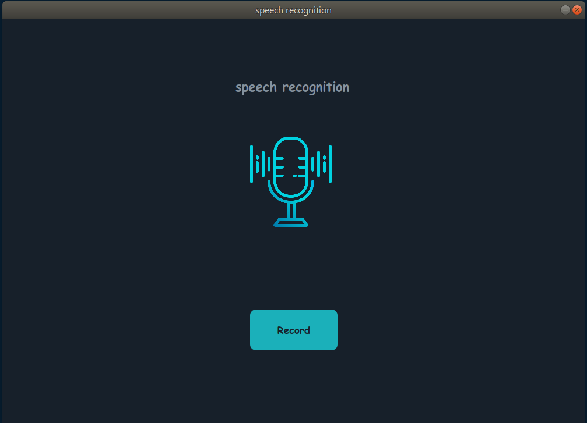

# speechRecognition

this project recognize 2 word : 'sholugh' & 'khalvat' (in persian)

- run the project with : python use.py
- (use python 3.3 and more)

    

- before run, create folder in './data' as 'records'
- press record to record your voice and the project will recognize what you said
- start recording as soon as press button
- duration of recording is 3 seconds
